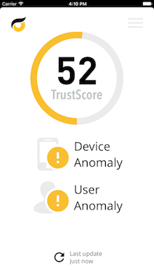
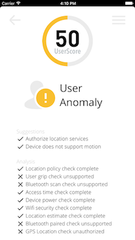
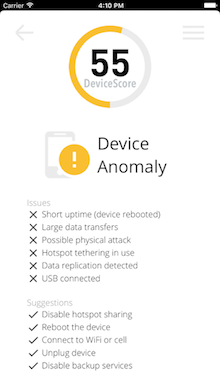

<br>

<p align="center"></p>
<hr>
<br>

<p align="center">  

The single risk management solution for mobile applications.

# Core Detection

Powers Sentegrity by providing a Trust Score of the user and device

## Usage

1)  Get a policy path

```
	// Create an error
    NSError *error;
    
    // Get appID and filenames for CoreDetection
    NSString *appID = kDefaultAppID;
    NSString *policyName = [appID stringByAppendingString:@".policy"];
    NSString *policyPath = [[[NSBundle mainBundle] resourcePath] stringByAppendingPathComponent:policyName];

    NSURL *policyURLPath;
    
    NSLog(@"policy path:%@", policyPath);
    
    // Make sure the policy exists first
    if ([[NSFileManager defaultManager] fileExistsAtPath:policyPath]) {
        // Default policy exists in the documents directory, convert to URL
        policyURLPath = [[NSURL alloc] initFileURLWithPath:policyPath];
    }
    else{
        NSLog(@"Failed to run Core Detection: No Policy");
    }
```

2)  Parse the policy


```
    // Parse the policy
    Sentegrity_Policy *policy = [[CoreDetection sharedDetection] parsePolicy:policyURLPath withError:&error];
```
    
3)  Perform Core Detection

```
    // Perform Core Detection
    [[CoreDetection sharedDetection] performCoreDetectionWithPolicy:policy withTimeout:30 withCallback:^(BOOL success, Sentegrity_TrustScore_Computation *computationResults, NSError **error) {
        if (success) {

            //protect mode analysis
            if(![[ProtectMode sharedProtectMode] analyzeResults:computationResults withError:error]){
                NSLog(@"Failed to analyze Core Detection results: %@", [*error localizedDescription]);
            }
            else{
                NSLog(@"\n\n+++ Core Detection Classification Scores +++ \n\nBreach Indicator:%d, \nSystem Security:%d, \nSystem Policy:%d, \nUser Anomaly:%d, \nUser Policy:%d\n\n", computationResults.systemBreachScore, computationResults.systemSecurityScore, computationResults.systemPolicyScore, computationResults.userAnomalyScore,computationResults.userPolicyScore );
                
                NSLog(@"\n\n+++ Core Detection Composite Results +++ \n\nDevice:%d, \nSystem:%d, \nUser:%d\n\n", computationResults.deviceScore, computationResults.systemScore, computationResults.userScore );
                
                NSLog(@"\n\n+++ Core Detection Trust Determinations +++\n\nDevice:%d, \nSystem:%d, \nUser:%d\n\n", computationResults.deviceTrusted, computationResults.systemTrusted, computationResults.userTrusted);
                
                NSLog(@"\n\n+++ Dashboard Data +++\n\nDevice Score:%d, \nSystem Icon:%d,  \nSystem Icon Text:%@, \nUser Icon:%d, \nUser Icon Text:%@\n\n", computationResults.deviceScore, computationResults.systemGUIIconID, computationResults.systemGUIIconText, computationResults.userGUIIconID, computationResults.userGUIIconText);
                
                NSLog(@"\n\n+++ System Detailed View +++\n\nSystem Score:%d, \nSystem Icon:%d,  \nSystem Icon Text:%@, \nIssues:%@, \nSuggestions:%@, \nAnalysis:%@\n\n", computationResults.systemScore, computationResults.systemGUIIconID, computationResults.systemGUIIconText, computationResults.systemGUIIssues, computationResults.systemGUISuggestions, computationResults.systemGUIAnalysis);
                
                NSLog(@"\n\n+++ User Detailed View +++\n\nUser Score:%d, \nUser Icon:%d,  \nUser Icon Text:%@, \nIssues:%@, \nSuggestions:%@, \nAnalysis:%@\n\n", computationResults.userScore, computationResults.userGUIIconID, computationResults.userGUIIconText, computationResults.userGUIIssues, computationResults.userGUISuggestions, computationResults.userGUIAnalysis);
                
                
                NSLog(@"\n\nErrors: %@", [*error localizedDescription]);
            }
            
        }
        else {NSLog(@"Failed to run Core Detection: %@", [*error localizedDescription]);}
    }];
```